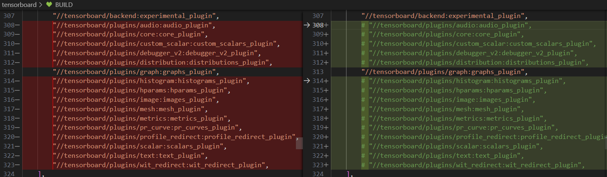
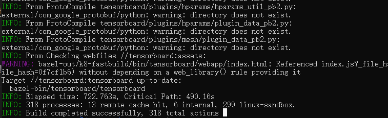
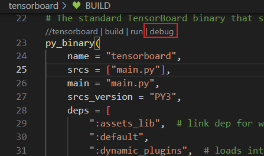

# TensorBoard 构建

下面是在蓝区构建TensorBoard的实操记录。

## 环境搭建

环境搭建采用在Windows系统上安装WSL2的方式作为操作系统，在此基础上搭建VPN去实现网络访问自由，然后按照 `Dockerfile` 文件记录的步骤搭建环境。

> 为什么不直接在Windows系统上，Windows系统上直接安装遇到的坑太多了，比如 `yarn package-patch` 无法应用成功、VS Studio 下载、路径格式差异等。

### 安装 WSL2

> 要求Windows 10版本需要是2004的更新（Build 19041）

#### 启用WSL功能

首先，你需要在Windows上启用WSL功能。

```
打开“控制面板”。
转到“程序” > “程序和功能”。
选择左侧的“启用或关闭Windows功能”。
在弹出的窗口中找到“适用于Linux的Windows子系统”或“Windows Subsystem for Linux”，勾选它。
点击“确定”并重启计算机。
```

#### 安装Linux发行版

```
打开Microsoft Store。
搜索你想要的Linux发行版（如Ubuntu, Debian, Fedora等）。
选择一个发行版，点击“获取”进行安装。
按照屏幕上的指示完成设置。
```

#### 升级到WSL 2（如果需要）

如果你安装的是WSL 1，需要升级到WSL 2。

打开“PowerShell”为管理员，运行以下命令来设置WSL 2为默认版本：

```powershell
wsl --set-default-version 2
wsl -l -v
wsl --set-version <distribution name> 2
```

### 搭建 VPN

由于 WSL2 是独立的虚拟网络，需要单独配置VPN。

如果你是用 clash 的话，可以参考 [在 Linux 中使用 Clash | CodeSwift](https://blog.iswiftai.com/posts/clash-linux/)，安装包在这 [Clash](https://www.clash.la/releases/)。

### 安装环境依赖

按照 `Dockerfile` 文件记录的步骤安装环境依赖。

```
sudo apt-get update
sudo apt-get install -y wget unzip python3 python3-pip python3-dev python-is-python3 default-jdk nodejs npm
python3 -m pip install -U pip
# 如果没有 yarn
npm install -g yarn
yarn config set registry https://registry.npm.taobao.org/
```

### 安装Bazel

```
export BAZEL_VERSION='4.2.2'
export BAZEL_SHA256SUM='11dea6c7cfd866ed520af19a6bb1d952f3e9f4ee60ffe84e63c0825d95cb5859'
ci/download_bazel.sh "${BAZEL_VERSION}" "${BAZEL_SHA256SUM}" ~/bazel
mv ~/bazel /usr/local/bin/bazel && chmod +x /usr/local/bin/bazel
npm i -g @bazel/ibazel
```

### 安装Python依赖

不要使用镜像源，可能会缺包

```
export BUILDTOOLS_VERSION='3.0.0'
export BUILDIFIER_SHA256SUM='e92a6793c7134c5431c58fbc34700664f101e5c9b1c1fcd93b97978e8b7f88db'
export BUILDOZER_SHA256SUM='3d58a0b6972e4535718cdd6c12778170ea7382de7c75bc3728f5719437ffb84d'
export TENSORFLOW_VERSION='tf-nightly'
pip install -r ./tensorboard/pip_package/requirements.txt -r ./tensorboard/pip_package/requirements_dev.txt "$TENSORFLOW_VERSION" && pip freeze --all
```

## 构建

### 拉取项目工程

```
git@github.com:tensorflow/tensorboard.git
```

### 拉取 bazel 构建依赖

```
cd tensorboard
bazel fetch //tensorboard/...
```

### 构建前准备

将shell脚本添加执行权限
```
find . -name *.sh | xargs chmod u+x
```

注释其他plugin


添加缓存，将下面一行加到 `.bazelrc`

```
common --repository_cache=".cache"
```

### 构建

```
bazel build tensorboard:tensorboard
ll ./bazel-bin/tensorboard/tensorboard
```



### 执行

```
bazel run tensorboard
# visit: http://localhost:6006
```

hot load

```
ibazel run tensorboard
```

### 调试

> 针对 vscode

#### 插件准备

1. 用 Remote Explorer 连接 WSL target
2. 安装插件 bazel-stack-vscode

#### 配置修改

1. 搜索Bazel相关的设置，找到“Bazel Executable”，设置指定Bazel可执行文件的路径。
2. 在跟目录创建 `.bazelversion` 文件，指定bazel版本，例如 4.2.2
3. 在以下位置点击 Debug



## 说明

1. 以上步骤只在一台机器上测试可行，不保证其他机器上会出现别的坑。
2. 增量编译的方式还需要探索，加快代码修改反馈周期
3. 如果有什么办法可以使编译的内容更少一点就更好了，现在编译过程比较耗时
4. 有不清楚或者不一样的情况，一起讨论