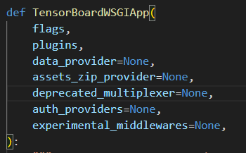

# Graph 数据输入和数据转换源码解读

Tensor Board 的后端部分是通过 `tensorboard/main.py` 拉起的，可以像使用 `tensorboard` 二进制文件一样传入 `--logdir` 等参数。

## API

Graph Plugin 部分，后端提供了三个 API：

### `/data/plugin/graphs/info`

用于界面左边选项

Returns meta information about data availabilities for a given run and a tag.
Below fields describe the data availabilities:
- "run_graph": v1 only. Whether a GraphDef of op nodes is present for an entire run.
      Historically, in v1, an op graph was written out for an entire run as a field on
      Event proto. In v2, graphs are written out as a Summary with respective tags.
- "op_graph": v2 only. Whether a GraphDef of op nodes is present with a tag.
- "profile": Whether a profile information is present with a RunMetadata and a tag.
- "conceptual_graph": Whether a GraphDef describing conceptual graph is present.
      The graph plugin currently only supports a Keras model written out as a
      JSON.

Please refer to below example for the full structure.

    {
      "train": {
        "run: "train",
        "tags": {
          "tag_1": {
            "tag": "tag_1",
            "op_graph": true,
            "profile": false,
            "conceptual_graph": false
          }
        },
        "run_graph": true
      }
    }

### `/data/plugin/graphs/graph?run=foo&limit_attr_size=1024&large_attrs_key=key`

返回 pbtxt 文本

Returns the graph definition for the given run and/or tag in pbtxt format.
The graph is composed of a list of nodes, where each node is a specific
TensorFlow operation which takes as inputs other nodes (operations).

The query parameters `limit_attr_size` and `large_attrs_key` are
optional, and function as follows:

  - `limit_attr_size` specifies the maximum allowed size in bytes,
    before the attribute is considered large and filtered out of the
    graph. If specified, it must be a positive integer. If not
    specified, no filtering is applied.

  - `large_attrs_key` is the attribute key that will be used for storing
    attributes that are too large. The value of this key (a list of
    strings) should be used by the client in order to determine which
    attributes have been filtered. This must be specified if
    `limit_attr_size` is specified.

For instance, for the query

    /data/plugin/graphs/graph?run=foo&limit_attr_size=1024&large_attrs_key=_too_large

there follows an example pbtxt response of a graph with 3 nodes, where
the second node had two large attributes "a" and "b" that were filtered
out (size > 1024):

    node {
      op: "Input"
      name: "A"
    }
    node {
      op: "Input"
      name: "B"
      attr {
        key: "small_attr"
        value: {
          s: "some string"
        }
      }
      attr {
        key: "_too_large"
        value {
          list {
            s: "a"
            s: "b"
          }
        }
      }
    }
    node {
      op: "MatMul"
      name: "C"
      input: "A"
      input: "B"
    }

Prior to filtering, the original node "B" had the following content:

    node {
      op: "Input"
      name: "B"
      attr {
        key: "small_attr"
        value: {
          s: "some string"
        }
      }
      attr {
        key: "a"
        value { Very large object... }
      }
      attr {
        key: "b"
        value { Very large object... }
      }
    }

### `/data/run_metadata?run=foo&tag=bar`

Session.run() 场景使用（暂时无关）

<!-- Given a run and tag, returns the metadata of a particular
`Session.run()` as a gzipped, pbtxt-serialized [`RunMetadata` proto].
For example:

    step_stats {
      dev_stats {
        device: "/job:localhost/replica:0/task:0/cpu:0"
        node_stats {
          node_name: "_SOURCE"
          all_start_micros: 1458337695775395
          op_start_rel_micros: 11
          op_end_rel_micros: 12
          all_end_rel_micros: 38
          memory {
            allocator_name: "cpu"
          }
          timeline_label: "_SOURCE = NoOp()"
          scheduled_micros: 1458337695775363
        }
      }
    } -->

## 数据输入

以上接口通过 PluginsCore 统一向上暴露，最后在 TensorBoardWSGI 进行注册。
同时，在 TensorBoardWSGI 通过 DataProvider 从 log 导入数据。

### 命令行参数传入

#### --logdir

## 数据转换

pbtxt -> pbtxt with shape -> api to frontend

## 结论

后端需要做的事情是，解析 pbtxt 文件，添加 shape 一类的属性，并把 修改后的 pbtxt 通过 `/data/plugin/graphs/info` 传给前端。